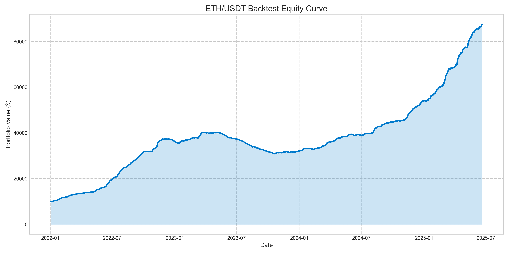

# Atlas


## Description

This is a trading bot that uses machine learning to automatically trade ETH/USDT cryptocurrency futures on Binance.
The project was created as a way to learn about algorithmic trading and quantitative finance. It includes everything from downloading market data and training a predictive model to backtesting the strategy and running it live on a Binance testnet.
The strategy is built around a `LightGBM` machine learning model that predicts short-term price movements. The bot operates on a cycle of fetching data, generating features, making predictions, and executing trades based on a signal persistence and cooldown logic to filter out market noise and avoid over-trading.

## Key Features

* **Automated Data Pipeline**: Downloads the latest market data from Binance for multiple timeframes (`1m`, `5m`, `15m`, `1h`).
* **Advanced Feature Engineering**: Utilizes the `pandas-ta` library to generate a rich set of technical indicators, including RSI, MACD, Bollinger Bands, and OBV, across different timeframes.
* **Robust Training with Walk-Forward Validation**: The model is trained using a walk-forward validation method, which simulates a more realistic trading environment by preventing lookahead bias.
* **Realistic Backtesting Engine**: A sophisticated backtesting engine that simulates trades with considerations for slippage, trading fees, signal persistence, and a post-trade cooldown period.
* **Live Testnet Trading**: A module to deploy the trained model and trade on the Binance Testnet, using the same logic proven in the backtest.

## Backtesting Performance

The model was backtested on data from `2022-01-01` to the present. The results demonstrate a potentially effective strategy under the specified parameters.

* **Total Return**: `775.21%`
* **Sharpe Ratio (Annualized)**: `9.85`
* **Max Drawdown**: `-23.36%`
* **Win Rate**: `79.23%`
* **Average Holding Time**: ~7.7 minutes
* **Total Trades**: `46,077`



## Tech Stack

* **Programming Language**: Python
* **Core Libraries**:
    * `pandas` & `numpy` for data manipulation
    * `scikit-learn` & `lightgbm` for machine learning
    * `python-binance` & `ccxt` for exchange interaction
    * `pandas-ta` for technical analysis
    * `matplotlib` for plotting
* **Environment**: `python-dotenv` for managing environment variables.

## Project Structure

The project is organized into modular components for clarity and scalability:

Of course. Here is the project structure formatted in a clean, copy-paste-friendly code block.

```
Atlas/
├── data/
├── features/
├── models/
├── backtest/
├── testnet/
├── .idea/
├── main.py
├── config.py
├── requirements.txt
└── README.md
```

## How to Get Started

1.  **Clone the repository:**
    ```bash
    git clone <your-repo-link>
    cd <your-repo-name>
    ```

2.  **Install dependencies:**
    ```bash
    pip install -r requirements.txt
    ```

3.  **Set up your environment:**
    Create a `.env` file in the root directory and add your Binance API keys:
    ```
    BINANCE_API_KEY="YOUR_API_KEY"
    BINANCE_API_SECRET="YOUR_API_SECRET"
    ```

4.  **Run the bot:**
    The `main.py` script is the entry point. You can perform different actions:
    ```bash
    # 1. Download data
    python main.py download

    # 2. Generate features
    python main.py features

    # 3. Train the model
    python main.py train

    # 4. Run a backtest
    python main.py backtest

    # 5. Start live trading on the testnet
    python main.py trade
    ```

## Important Disclaimer

This project was developed as part of my research as a student learning about machine learning and quantitative finance. While the backtesting results are promising, it is crucial to understand the following:

* **This is not financial advice.** The strategies and code in this repository are for educational and research purposes only.
* **Profitability is not guaranteed.** Real-world performance can differ significantly from backtesting results due to factors like market volatility, liquidity, and latency.
* **Trading fees are a major factor.** With Binance's current fee structure, achieving profitability with a high-frequency strategy like this is extremely challenging. The model demonstrates a theoretical edge, but transaction costs can quickly erode any potential gains.
* **Use at your own risk.** If you decide to adapt this code for live trading with real capital, you do so at your own risk.

Always be cautious and conduct your own thorough research before deploying any trading bot. Good luck!
